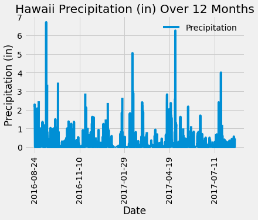

# SQLAlchemy Challenge - Surfs Up!
You've decided to treat yourself to a long holiday vacation in Honolulu, Hawaii! To help with your trip planning, you need to do some climate analysis on the area

## SQLAlchemy Challenge Structure
```
SQLAlchemy Challenge
|__ Images/                  # contains images of output graphs
|
|__ Resources/               # contains resource files
|
|
|__ .gitignore               # gitignore file
|
|__ README.md                # readme file
|
|__ app.py                   # python file used to create Flask API server
|
|__ hawaii_climate.ipynb     # contains analysis on Hawaii climate
```

## Dependencies and Setup
```
%matplotlib inline
from matplotlib import style
style.use('fivethirtyeight')
import matplotlib.pyplot as plt
import numpy as np
import pandas as pd
import datetime as dt
```
```
import sqlalchemy
from sqlalchemy.ext.automap import automap_base
from sqlalchemy.orm import Session
from sqlalchemy import create_engine, func
```

# Part 1: Climate Analysis and Exploration
## Connecting to SQLite Database and Reflection
```
engine = create_engine("sqlite:///Resources/hawaii.sqlite")
Base = automap_base()
Base.prepare(engine, reflect=True)
session = Session(engine)
```

## Precipitation Analysis
- Query the last 12 months of precipitation data
```
year_ago = dt.date(2017, 8, 23) - dt.timedelta(days = 365)  # (2016-8-23)
precipitation_data = session.query(Measurement.date, Measurement.prcp).filter(Measurement.date > year_ago).all()
```
- Load queries into a DataFrame, set index to date column and sort values by date
- Plot precipitation data



## Station Analysis
- Query to find the total number of stations
```
stations_count = session.query(func.count(Station.station)).scalar()
```
- Query to find the most active station:
  - List stations and observation counts in descending order
```
stations_active = session.query(Measurement.station, func.count(Measurement.station))\
                            .group_by(Measurement.station)\
                            .order_by(func.count(Measurement.station).desc()).all()
```
- Query to find the lowest, highest and average temperature of the most active station
```
sel = [func.min(Measurement.tobs),
       func.max(Measurement.tobs),
       func.avg(Measurement.tobs)]
                
records = session.query(*sel).filter(Measurement.station == "USC00519281").all()
```
- Plot as a histogram the last 12 months of temperature observation data for the most active station
```
year_temperature_station = session.query(Measurement.date, Measurement.tobs)\
                                    .filter(Measurement.station == "USC00519281")\
                                    .filter(Measurement.date > year_ago).all()
```


## Bonus Temperature Analysis
- Plot trip average temperature between 2015-02-03 to 2015-02-13 using the calc_temps function
```
def calc_temps(start_date, end_date):
    """TMIN, TAVG, and TMAX for a list of dates.
    
    Args:
        start_date (string): A date string in the format %Y-%m-%d
        end_date (string): A date string in the format %Y-%m-%d
        
    Returns:
        TMIN, TAVE, and TMAX
    """
    
    return session.query(func.min(Measurement.tobs), func.avg(Measurement.tobs), func.max(Measurement.tobs)).\
        filter(Measurement.date >= start_date).filter(Measurement.date <= end_date).all()
```


## Bonus Daily Rainfall Average
- Calculate the rainfall per weather station using previous dates and sort this in descending order by precipitation amount and list the station, name, latitude, longitude, and elevation
```
start_date = '2015-02-03'
end_date = '2015-02-13'

sel = [Station.station, Station.name, Station.latitude, Station.longitude, Station.elevation, func.sum(Measurement.prcp)]

results = session.query(*sel).filter(Station.station == Measurement.station).filter(Measurement.date >= start_date)\
    .filter(Measurement.date <= end_date).group_by(Measurement.station).order_by(func.sum(Measurement.prcp).desc()).all()
```
- Plot an area plot for daily temperature maximum, minimum and average using the daily_normals function
```
def daily_normals(date):
    """Daily Normals.
    
    Args:
        date (str): A date string in the format '%m-%d'
        
    Returns:
        A list of tuples containing the daily normals, tmin, tavg, and tmax
    
    """
    
    sel = [func.min(Measurement.tobs), func.avg(Measurement.tobs), func.max(Measurement.tobs)]
    return session.query(*sel).filter(func.strftime("%m-%d", Measurement.date) == date).all()
```


# Part 2: Climate App
- Design a Flask API based on the queries previously developed
```
Welcome to "Hawaii Surfs Up!" API
Available Routes:
---------------------
# Precipitation measurements
/api/v1.0/precipitation

# List of stations
/api/v1.0/stations

# Temperature observations (TOBS) for the previous year of the most active station: USC00519281
/api/v1.0/tobs

----------------------
Date Format: yyyy-mm-dd
# Temperature minimum, maximum and average for dates greater than start date (e.g. ../2010-01-01)
/api/v1.0/yyyy-mm-dd

# Temperature minimum, maximum and average for dates between start and end date (e.g. ../2010-01-01/2017-08-23)<
/api/v1.0/yyyy-mm-dd/yyyy-mm-dd
----------------------
*Data available for period between 2010-01-01 and 2017-08-23
```
- Example code for route /api/v1.0/yyyy-mm-dd/yyyy-mm-dd:
```
@app.route("/api/v1.0/<start>/<end>")
def date_start_end_page(start, end):
    print("Request for date_start_end_page")

    # Create our session (link) from Python to the DB
    session = Session(engine)

    # Create sel containing functions for minimum, maximum and average
    sel = [Measurement.date,
        func.min(Measurement.tobs),
       func.max(Measurement.tobs),
       func.avg(Measurement.tobs)]

    # Query database for results greater than starting date and less than ending date 
    results = session.query(*sel).filter(Measurement.date >= start).filter(Measurement.date <= end).group_by(Measurement.date).all()

    # Close the Query
    session.close()

    return jsonify(results)
```